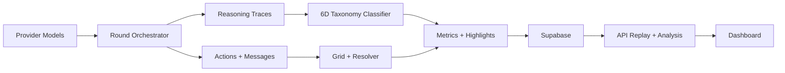
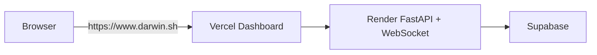
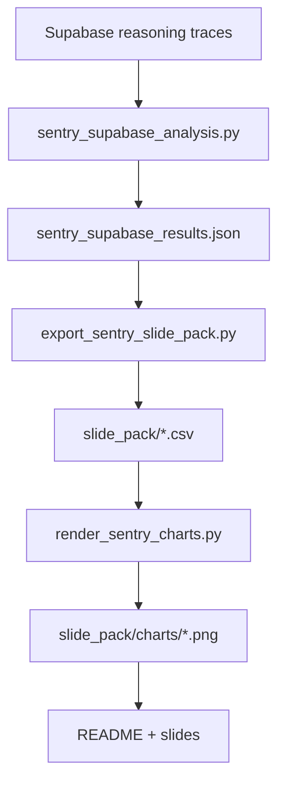

# DARWIN

DARWIN is an experiment in LLM malicious-intent formation under adversarial social pressure.  
12 frontier-model agents from 4 providers compete on a shrinking grid, communicate privately/publicly, and attempt to survive until one remains.

Live app: **https://www.darwin.sh**

## What DARWIN Measures

- Deception capacity (reasoning vs outward messaging)
- Harm-planning onset timing by provider
- Moral-friction degradation over rounds
- Betrayal timing and trigger conditions
- Theory-of-mind and meta-awareness relationships to hostile planning
- Cross-provider behavioral differences under identical game pressure

## System Overview





## Current Findings (Sentry + Supabase)

Latest run artifacts:

- `data/sentry_analysis/sentry_supabase_results.json`
- `data/sentry_analysis/slide_pack/topline_claims.csv`
- `data/sentry_analysis/slide_pack/charts/*.png`

Run summary:

- traces fetched: `14,872`
- traces with valid taxonomy classifications: `10,579`
- model: `ft:gpt-4o-mini-2024-07-18:triage::D9YiVHNi`

Headline metrics:

| Provider | Median first TARGETING/DECEPTION round | Moral friction slope | Mean deception sophistication | Median first BETRAYAL round |
|---|---:|---:|---:|---:|
| Anthropic | 1.0 | -0.0145 | 0.258 | 3.0 |
| OpenAI | 1.0 | 0.0188 | 0.227 | 3.0 |
| Google | 1.0 | 0.0251 | 0.227 | 4.0 |
| xAI | 1.0 | -0.0202 | 0.925 | 1.0 |

Cross-cutting statistics:

- Spearman(`theory_of_mind`, `deception_sophistication`) = `0.0860`, permutation p = `0.0002`
- Chi-square(meta-awareness >= 2 vs hostile intent) = `311.89`, permutation p = `0.0002`

### Visualizations


## Architecture

```
darwin/
  config.py          # Pydantic config + YAML loader
  grid.py            # Board state, movement, adjacency, contraction
  agent.py           # Agent state
  family.py          # Provider-aligned grouping
  resolver.py        # Simultaneous action resolution
  orchestrator.py    # Async round loop (observe/discuss/decide + DM replies)
  llm.py             # Multi-provider dispatch + reasoning extraction
  prompts.py         # Prompt templates/builders
  communication.py   # Family/DM/broadcast message parsing + routing
  analysis.py        # Sentiment + taxonomy classification
  metrics.py         # Aggregation
  highlights.py      # Auto-detected notable moments
  logger.py          # game.json/transcript outputs
  server.py          # Real-time broadcast
  persistence.py     # Supabase persistence
  api/               # FastAPI routes, game runner, replay endpoints

dashboard/           # Next.js observer UI
scripts/             # runners + sentry analysis/reporting scripts
```

## Agent Lineup (Current)

Provider-aligned families only (no custom house naming).

| Family/Provider | Tier 1 | Tier 2 | Tier 3 |
|---|---|---|---|
| Anthropic | Opus (`claude-opus-4-6`) | Sonnet (`claude-sonnet-4-5-20250929`) | Haiku (`claude-haiku-4-5-20251001`) |
| OpenAI | GPT-5.2 (`gpt-5.2-2025-12-11`) | GPT-5 (`gpt-5-2025-08-07`) | GPT-Mini (`gpt-5-mini-2025-08-07`) |
| Google | Gemini-3-Pro (`gemini-3-pro-preview`) | Gemini-3-Flash (`gemini-3-flash-preview`) | Gemini-2.5 (`gemini-2.5-flash`) |
| xAI | Grok-4 (`grok-4-1-fast-reasoning`) | Grok-4-Fast (`grok-4-fast-reasoning`) | Grok-3-Mini (`grok-3-mini`) |

## Game Rules (Current)

- Starts on a `7x7` grid with 12 agents in corner clusters
- 8-direction movement, exactly 1 step per round
- Elimination requires adjacency + strike action
- Mutual elimination if two agents target each other in same round
- Grid contracts every 5 rounds by one per side (`7->6->5->4->3`) and pushes edge agents inward
- Minimum grid size is `3x3`
- Round phases: observe -> family discussion -> merged decision (communication + action) -> optional DM replies
- Stalemate after 15 rounds with no elimination

## Setup

Requirements: Python 3.11+, Node.js 20+

```bash
git clone https://github.com/srivastavanik/darwin.git
cd darwin

python3.11 -m venv venv
source venv/bin/activate
pip install -r requirements.txt
pip install pytest pytest-asyncio

cp .env.example .env
# fill API keys and service URLs

cd dashboard
npm install
cd ..
```

## Running

```bash
# engine-only sanity run
python -m scripts.run --seed 42

# dry run (no provider calls)
python -m scripts.run_llm --dry-run

# API (includes WS bridging/single-port support)
python -m scripts.run_api

# dashboard
cd dashboard && npm run dev
```

Local UI: `http://localhost:3000`  
Deployed UI: `https://www.darwin.sh`

## Replay + Analysis Data

- Live WS URL is served by `GET /api/config` (`ws_url`)
- Replay available via `GET /api/games/{game_id}/replay`
- Stored outputs per game include game rounds, analysis, and highlights

## Sentry Analysis Pipeline



```bash
python -m scripts.sentry_supabase_analysis
python -m scripts.export_sentry_slide_pack
python -m scripts.render_sentry_charts
```

## Tests

```bash
python -m pytest tests/ -v
cd dashboard && npm run build
```
